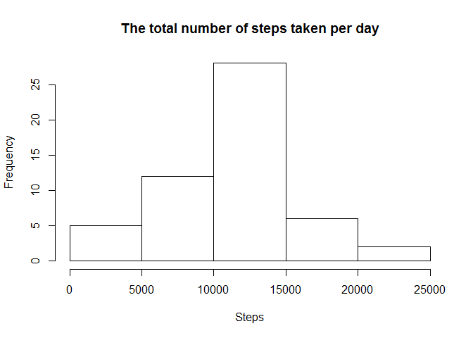
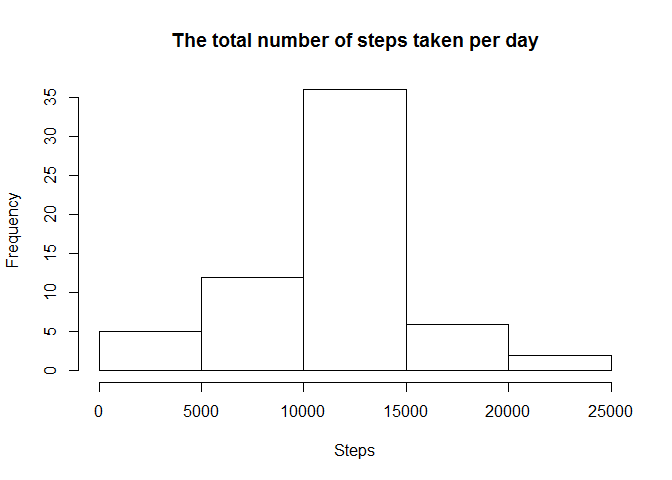

# Reproducible Research: Peer Assessment 1


## Loading and preprocessing the data


```r
df <- read.csv(".//activity//activity.csv",stringsAsFactors = FALSE)
df$date<-as.Date(df$date)
```

## What is mean total number of steps taken per day?


```r
library(dplyr)
```

```
## 
## Attaching package: 'dplyr'
## 
## The following objects are masked from 'package:stats':
## 
##     filter, lag
## 
## The following objects are masked from 'package:base':
## 
##     intersect, setdiff, setequal, union
```

```r
dfSteps<-df %>% group_by(date) %>% summarize(steps=sum(steps))
hist(dfSteps$steps, xlab="Steps", main="The total number of steps taken per day")
```

 

```r
stepsMean<-mean(dfSteps$steps, na.rm=TRUE)
stepsMedian<-median(dfSteps$steps, na.rm = TRUE)
```

The mean of the total number of steps taken per day is 1.0766189\times 10^{4}  

The median of the total number of steps taken per day is 10765

## What is the average daily activity pattern?


```r
dfIntervals<-df %>% group_by(interval) %>% summarize(steps=mean(steps, na.rm=TRUE))
plot(dfIntervals$interval, dfIntervals$steps, type='l', xlab="Interval", ylab="Steps", main="Average daily activity pattern")
```

 

```r
maxInt<- (dfIntervals %>% arrange(desc(steps)) %>% slice(1))$interval
```

 Interval, which on average across all the days in the dataset, contains the maximum number of steps: 835

## Imputing missing values

Using intervals means, calculated earlier, for filling values  


```r
totalNA <- sum(is.na(df$steps))
dfFilledNa <- merge(df,dfIntervals, by.x="interval", by.y="interval")
dfFilledNa <- mutate(dfFilledNa, steps=ifelse(is.na(steps.x), steps.y, steps.x))
dfFilledNa<-select(dfFilledNa, -c(steps.x,steps.y))
dfSteps<-dfFilledNa %>% group_by(date) %>% summarize(steps=sum(steps))
hist(dfSteps$steps, xlab="Steps", main="The total number of steps taken per day")
```

 

```r
stepsMean<-mean(dfSteps$steps, na.rm=TRUE)
stepsMedian<-median(dfSteps$steps, na.rm = TRUE)
```
The total number of missing values is 2304  

The mean of the total number of steps taken per day is 1.0766189\times 10^{4}  

The median of the total number of steps taken per day is 1.0766189\times 10^{4}  

After filling in the missing values the median has been slightly increased, but there were no considerable changes.  

## Are there differences in activity patterns between weekdays and weekends?


```r
library(lattice)
Sys.setlocale("LC_TIME", "English")
```

```
## [1] "English_United States.1252"
```

```r
dfFilledNa <- mutate(dfFilledNa, DayType = as.factor(ifelse(weekdays(date, T) %in% c('Sat','Sun'), "weekend", "weekday")))
dfFilledNaGrouped <- dfFilledNa %>% group_by(interval, DayType) %>% summarize(steps=mean(steps))
xyplot(steps ~ interval|DayType, data=dfFilledNaGrouped, type='l', layout=c(1,2))
```

 
